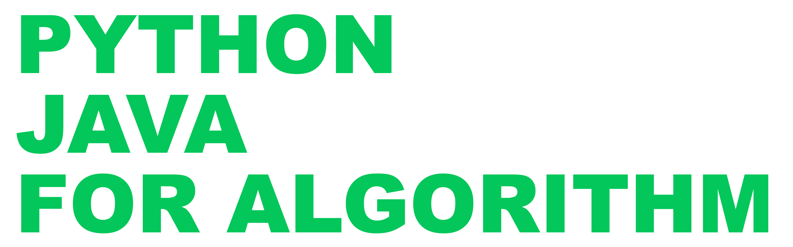

# 알고리즘을 위한 파이썬, 자바 😃
    

요즘은 코딩테스트를 보면, 언어에 제한을 두는 경우가 있습니다.

- Front - JavaScript
- Machine Learning - python
- **Server - Python, Java**

`python, Java` 로 문제 풀면서 정리해봅시다.

# 🧩 문제 풀이
파이썬, 자바 2개의 언어로 풀었습니다.

리트코드의 경우 [파이썬 알고리즘 인터뷰](http://www.kyobobook.co.kr/product/detailViewKor.laf?ejkGb=KOR&mallGb=KOR&barcode=9791189909178&orderClick=LEa&Kc=)에 소개된 문제를 위주로 진행했습니다.

[리트코드](https://github.com/skyepodium/algorithm-for-python-java/tree/master/examples/leetcode)   

[프로그래머스](https://github.com/skyepodium/algorithm-for-python-java/tree/master/examples/programmers)            
          

# 📕 요약
## 1. 내장함수
[정렬 - 내장함수](https://github.com/skyepodium/algorithm-for-python-java/blob/master/summary/%EC%A0%95%EB%A0%AC/%EC%A0%95%EB%A0%AC%20-%20%EB%82%B4%EC%9E%A5%ED%95%A8%EC%88%98.md)

## 2. 자료구조
[해시맵](https://github.com/skyepodium/algorithm-for-python-java/blob/master/summary/%EC%9E%90%EB%A3%8C%EA%B5%AC%EC%A1%B0/%ED%95%B4%EC%8B%9C%EB%A7%B5.md)

## 3. 문자열
[정규 표현식](https://github.com/skyepodium/algorithm-for-python-java/blob/master/summary/%EB%AC%B8%EC%9E%90%EC%97%B4/%EC%A0%95%EA%B7%9C%20%ED%91%9C%ED%98%84%EC%8B%9D.md)         
[문자열 뒤집기](https://github.com/skyepodium/algorithm-for-python-java/blob/master/summary/%EB%AC%B8%EC%9E%90%EC%97%B4/%EB%AC%B8%EC%9E%90%EC%97%B4%20%EB%92%A4%EC%A7%91%EA%B8%B0.md)
[문자열을 특정 단어 기준으로 분리해서 리스트로 만들기](https://github.com/skyepodium/algorithm-for-python-java/blob/master/summary/%EB%AC%B8%EC%9E%90%EC%97%B4/%EB%AC%B8%EC%9E%90%EC%97%B4%EC%9D%84%20%ED%8A%B9%EC%A0%95%20%EB%8B%A8%EC%96%B4%20%EA%B8%B0%EC%A4%80%EC%9C%BC%EB%A1%9C%20%EB%B6%84%EB%A6%AC%ED%95%B4%EC%84%9C%20%EB%A6%AC%EC%8A%A4%ED%8A%B8%EB%A1%9C%20%EB%A7%8C%EB%93%A4%EA%B8%B0.md)     
[문자열 정렬](https://github.com/skyepodium/algorithm-for-python-java/blob/master/summary/%EB%AC%B8%EC%9E%90%EC%97%B4/%EB%AC%B8%EC%9E%90%EC%97%B4%20%EC%A0%95%EB%A0%AC.md)        
[문자열이 숫자인지 판별](https://github.com/skyepodium/algorithm-for-python-java/blob/master/summary/%EB%AC%B8%EC%9E%90%EC%97%B4/%EB%AC%B8%EC%9E%90%EC%97%B4%EC%9D%B4%20%EC%88%AB%EC%9E%90%EC%9D%B8%EC%A7%80%20%ED%8C%90%EB%B3%84.md)     
[대문자, 소문자로 변경](https://github.com/skyepodium/algorithm-for-python-java/blob/master/summary/%EB%AC%B8%EC%9E%90%EC%97%B4/%EB%8C%80%EB%AC%B8%EC%9E%90%2C%20%EC%86%8C%EB%AC%B8%EC%9E%90%EB%A1%9C%20%EB%B3%80%EA%B2%BD.md)
## 4. 배열
[배열 뒤집기](https://github.com/skyepodium/algorithm-for-python-java/blob/master/summary/%EB%B0%B0%EC%97%B4/%EB%B0%B0%EC%97%B4%20%EB%92%A4%EC%A7%91%EA%B8%B0.md)     
[짧은 배열 반환](https://github.com/skyepodium/python-java-for-algorithm/blob/master/summary/%EB%B0%B0%EC%97%B4/%EC%A7%A7%EC%9D%80%20%EB%B0%B0%EC%97%B4%20%EB%B0%98%ED%99%98.md)

